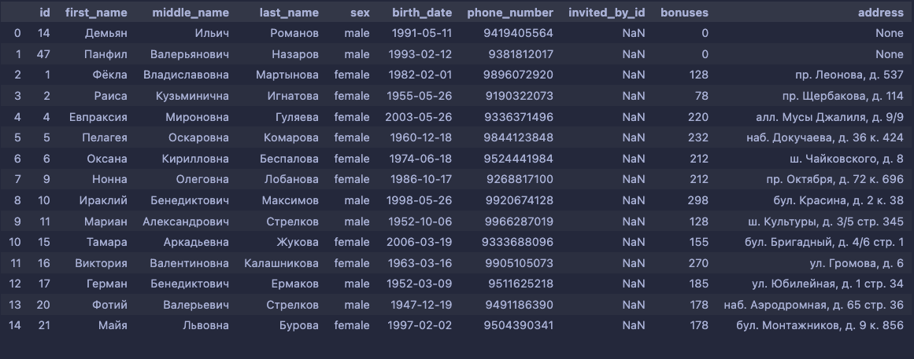
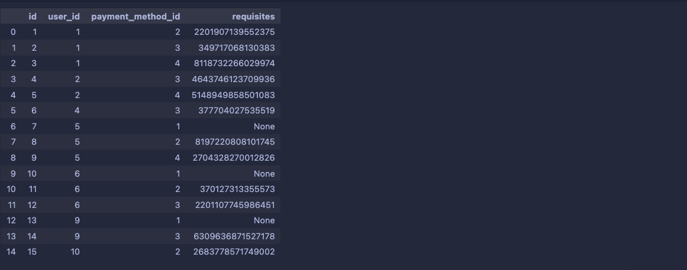

# Приложение. Отчеты

## Приложения

{#fig:ER-KMPO}

{#fig:ER-KMBD}

{#fig:ER-LMBD}

{#fig:RL-LMBD}

```{.sql include="assets/code/custom_types/custom-types.sql" caption="Создание ENUM-типов gender и status" #lst:types}
```

```{.sql include="assets/code/create_tables/couriers.sql" caption="Создание таблицы couriers" #lst:create-1}
```

```{.sql include="assets/code/create_tables/dishes.sql" caption="Создание таблицы dishes" #lst:create-2}
```

```{.sql include="assets/code/create_tables/ingredients.sql" caption="Создание таблицы ingredients" #lst:create-3}
```

```{.sql include="assets/code/create_tables/menus.sql" caption="Создание таблицы menus" #lst:create-4}
```

```{.sql include="assets/code/create_tables/payment_methods.sql" caption="Создание таблицы payment_methods" #lst:create-5}
```

```{.sql include="assets/code/create_tables/preference_categories.sql" caption="Создание таблицы preference_categories" #lst:create-6}
```

```{.sql include="assets/code/create_tables/suppliers.sql" caption="Создание таблицы suppliers" #lst:create-7}
```

```{.sql include="assets/code/create_tables/users.sql" caption="Создание таблицы users" #lst:create-8}
```

```{.sql include="assets/code/create_tables/dishes_ingredients.sql" caption="Создание таблицы dishes_ingredients" #lst:create-9}
```

```{.sql include="assets/code/create_tables/dishes_menus.sql" caption="Создание таблицы dishes_menus" #lst:create-10}
```

```{.sql include="assets/code/create_tables/ingredients_suppliers.sql" caption="Создание таблицы ingredients_suppliers" #lst:create-11}
```

```{.sql include="assets/code/create_tables/payment_infos.sql" caption="Создание таблицы payment_infos" #lst:create-12}
```

```{.sql include="assets/code/create_tables/preferences.sql" caption="Создание таблицы preferences" #lst:create-13}
```

```{.sql include="assets/code/create_tables/ingredients_preferences.sql" caption="Создание таблицы ingredients_preferences" #lst:create-14}
```

```{.sql include="assets/code/create_tables/orders.sql" caption="Создание таблицы orders" #lst:create-15}
```

```{.sql include="assets/code/create_tables/preferences_users.sql" caption="Создание таблицы preferences_users" #lst:create-16}
```

%python
```{.python include="assets/code/seeding/common.py" caption="Подключение к базе данных с помощью psycopg2" #lst:seeding-1}
```

```{.python include="assets/code/seeding/seed.py" caption="Вызов функций заполнения всех таблиц" #lst:seeding-2}
```

```{.python include="assets/code/seeding/seeders/payment_methods_seeder.py" caption="Заполнение таблицы payment_methods" #lst:seeding-3}
```

```{.python include="assets/code/seeding/seeders/users_seeder.py" caption="Заполнение таблицы users" #lst:seeding-4}
```

```{.python include="assets/code/seeding/seeders/payment_infos_seeder.py" caption="Заполнение таблицы payment_infos" #lst:seeding-5}
```

```{.python include="assets/code/seeding/seeders/couriers_seeder.py" caption="Заполнение таблицы couriers" #lst:seeding-6}
```

```{.python include="assets/code/seeding/seeders/menus_seeder.py" caption="Заполнение таблицы menus" #lst:seeding-7}
```

```{.python include="assets/code/seeding/seeders/orders_seeder.py" caption="Заполнение таблицы orders" #lst:seeding-8}
```

```{.python include="assets/code/seeding/seeders/preference_categories_seeder.py" caption="Заполнение таблицы preference_categories" #lst:seeding-9}
```

```{.python include="assets/code/seeding/seeders/preferences_seeder.py" caption="Заполнение таблицы preferences" #lst:seeding-10}
```

```{.python include="assets/code/seeding/seeders/preferences_users_seeder.py" caption="Заполнение таблицы preferences_users" #lst:seeding-11}
```

```{.python include="assets/code/seeding/seeders/suppliers_seeder.py" caption="Заполнение таблицы suppliers" #lst:seeding-12}
```

```{.python include="assets/code/seeding/seeders/ingredients_seeder.py" caption="Заполнение таблицы ingredients" #lst:seeding-13}
```

```{.python include="assets/code/seeding/seeders/ingredients_suppliers_seeder.py" caption="Заполнение таблицы ingredients_suppliers" #lst:seeding-14}
```

```{.python include="assets/code/seeding/seeders/dishes_seeder.py" caption="Заполнение таблицы dishes" #lst:seeding-15}
```

```{.python include="assets/code/seeding/seeders/dishes_ingredients_seeder.py" caption="Заполнение таблицы dishes_ingredients" #lst:seeding-16}
```

```{.python include="assets/code/seeding/seeders/ingredients_preferences_seeder.py" caption="Заполнение таблицы ingredients_preferences" #lst:seeding-17}
```

```{.python include="assets/code/seeding/seeders/dishes_menus_seeder.py" caption="Заполнение таблицы dishes_menus" #lst:seeding-18}
```

{#fig:filled-1}

{#fig:filled-2}

{#fig:filled-3}

{#fig:filled-4}

{#fig:filled-5}

{#fig:filled-6}

{#fig:filled-7}

{#fig:filled-8}

{#fig:filled-9}

{#fig:filled-10}

{#fig:filled-11}

{#fig:filled-12}

{#fig:filled-13}

{#fig:filled-14}

{#fig:filled-15}

```{.sql include="assets/code/queries/q_1.sql" caption="Запрос 1 на SQL" #lst:query-1}
```

{#fig:query-1}

```{.sql include="assets/code/queries/q_2.sql" caption="Запрос 2 на SQL" #lst:query-2}
```

{#fig:query-2}

```{.sql include="assets/code/queries/q_3.sql" caption="Запрос 3 на SQL" #lst:query-3}
```

{#fig:query-3}

```{.sql include="assets/code/queries/q_4.sql" caption="Запрос 4 на SQL" #lst:query-4}
```

{#fig:query-4}

```{.sql include="assets/code/queries/q_5.sql" caption="Запрос 5 на SQL" #lst:query-5}
```

{#fig:query-5}

```{.sql include="assets/code/queries/q_6.sql" caption="Запрос 6 на SQL" #lst:query-6}
```

{#fig:query-6}

```{.sql include="assets/code/queries/q_7.sql" caption="Запрос 7 на SQL" #lst:query-7}
```

{#fig:query-7}

```{.sql include="assets/code/queries/q_8.sql" caption="Запрос 8 на SQL" #lst:query-8}
```

{#fig:query-8}

```{.sql include="assets/code/queries/q_9.sql" caption="Запрос 9 на SQL" #lst:query-9}
```

{#fig:query-9}

```{.sql include="assets/code/queries/q_10.sql" caption="Запрос 10 на SQL" #lst:query-10}
```

{#fig:query-10}

```{.sql include="assets/code/queries/q_11.sql" caption="Запрос 11 на SQL" #lst:query-11}
```

{#fig:query-11}

```{.sql include="assets/code/queries/q_12.sql" caption="Запрос 12 на SQL" #lst:query-12}
```

{#fig:query-12}

\newpage

## Отчеты

### Отчет №1

\noindent \textbf{Название:} Анализ выручки сервиса за предыдущие 30 дней

\noindent \textbf{Дата создания отчета:} 25.05.2025

\noindent \textbf{Инструментальные средства:} *Python, Matplotlib, Seaborn*

\noindent \textbf{Диаграмма:} 


\noindent \textbf{Код запроса:} 
```{.sql include="assets/code/reports/r_1.sql" caption="Код запроса к отчету №1"}
```

\newpage

### Отчет №2

\noindent \textbf{Название:} Анализ распределения количества бонусов среди пользователей 

\noindent \textbf{Дата создания отчета:} 25.05.2025

\noindent \textbf{Инструментальные средства:} *Python, Pandas, Matplotlib, Seaborn*

\noindent \textbf{Диаграмма:} 


\noindent \textbf{Коды запроса:} 
```{.sql include="assets/code/reports/r_2_1.sql" caption="Код запроса к отчету №2"}
```

```{.sql include="assets/code/reports/r_2_2.sql" caption="Код запроса к отчету №2"}
```

\newpage

### Отчет №3

\noindent \textbf{Название:} Анализ частоты встречаемости различных пар блюд в меню 

\noindent \textbf{Дата создания отчета:} 25.05.2025

\noindent \textbf{Инструментальные средства:} *Python, Pandas, Matplotlib, Seaborn*

\noindent \textbf{Диаграмма:} 


\noindent \textbf{Код запроса:} 
```{.sql include="assets/code/reports/r_3.sql" caption="Код запроса к отчету №3"}
```